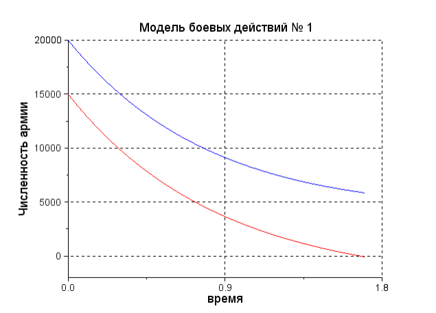

---
## Front matter
lang: ru-RU
title: Презентация по первой лабораторной. Предмет - Математическое моделирование.
author: |
	Попов Олег Павлович\inst{1}
institute: |
	\inst{1}RUDN University, Moscow, Russian Federation
date: 2021, 18 Февраля -- 20 Февраля

## Formatting
toc: false
slide_level: 2
theme: metropolis
header-includes:
 - \metroset{progressbar=frametitle,sectionpage=progressbar,numbering=fraction}
 - '\makeatletter'
 - '\beamer@ignorenonframefalse'
 - '\makeatother'
aspectratio: 43
section-titles: true
mainfont: DejaVuSerif
romanfont: DejaVuSerif
sansfont: DejaVuSans
monofont: DejaVuSansMono
---

# Модель ведения боевых действий

## Введение

Продолжаем рассматривать различные математические модели тесно связанные с
реальной жизнью. В этот раз посмотрим на модель ведения боевых действий.
Если бы это была очередная задачка из учебника по математике, то на вопрос
из разряда "Кто победит?" ответом было бы "Тот, у кого больше людей". Но
когда дело доходит до реальных рассчетов, принято рассматривать еще и влияние
дополнительных факторов, таких как продуманность стратегий, например. В этом
случае при расчете предполагаемых исходов войны пригодится модель ведения боевых
действий.

## Теория

Рассмотрим некоторые простейшие модели боевых действий – модели Ланчестера.
В противоборстве могут принимать участие как регулярные войска, так и
партизанские отряды. В общем случае главной характеристикой соперников
являются численности сторон. Если в какой-то момент времени одна из
численностей обращается в нуль, то данная сторона считается проигравшей.

Рассмотрим три случая ведения боевых действий:

1. Боевые действия между регулярными войсками

2. Боевые действия с участием регулярных войск и партизанских отрядов

3. Боевые действия между партизанскими отрядами

## Теория

В первом случае численность регулярных войск определяется тремя факторами:

- скорость уменьшения численности войск из-за причин, не связанных с
боевыми действиями (болезни, травмы, дезертирство);

- скорость потерь, обусловленных боевыми действиями
противоборствующих сторон (что связанно с качеством стратегии,
	уровнем вооружения, профессионализмом солдат и т.п.);

- скорость поступления подкрепления (задаётся некоторой функцией от
	времени).

## Теория

В этом случае модель боевых действий между регулярными войсками
описывается следующим образом

$\frac{dx}{dt} = -a(t)x(t) - b(t)y(t) + P(t)$

$\frac{dy}{dt} = -c(t)x(t) - h(t)y(t) + Q(t)$

Потери, не связанные с боевыми действиями, описывают члены
$-a(t)x(t)$ и $-h(t)y(t)$, члены $-b(t)y(t)$ и $-c(t)x(t)$ отражают
потери на поле боя. Коэффициенты $b(t)$ и $c(t)$ указывают на эффективность
боевых действий со стороны у и х соответственно, $a(t), h(t)$ - величины,
характеризующие степень влияния различных факторов на потери. Функции
$P(t), Q(t)$ учитывают возможность подхода подкрепления к войскам
Х и У в течение одного дня.

## Теория

Во втором случае в борьбу добавляются партизанские отряды. Нерегулярные
войска в отличии от постоянной армии менее уязвимы, так как действуют скрытно,
в этом случае сопернику приходится действовать неизбирательно, по площадям,
занимаемым партизанами. Поэтому считается, что тем потерь партизан,
проводящих свои операции в разных местах на некоторой известной территории,
пропорционален не только численности армейских соединений, но и численности
самих партизан.

## Теория

В результате модель принимает вид:

$\frac{dx}{dt} = -a(t)x(t) - b(t)y(t) + P(t)$

$\frac{dy}{dt} = -c(t)x(t)y(t) - h(t)y(t) + Q(t)$

## Теория

Модель ведение боевых действий между партизанскими отрядами с учетом
предположений, сделанных в предыдущем случаем, имеет вид:

$\frac{dx}{dt} = -a(t)x(t) - b(t)x(t)y(t) + P(t)$

$\frac{dy}{dt} = -c(t)x(t)y(t) - h(t)y(t) + Q(t)$

## Итог

При решении задачи, связанной с моделью Ланчестера, необходимо построить два
графика $\frac{dx}{dt}$ и $\frac{dy}{dt}$, которые относятся к армиям X и Y
соответственно. Если график пересекает границу $y = 0$, то, следовательно,
численность данной армии равна нулю, и победа достается другой армии.

{ width=50% }

## {.standout}

Спасибо за внимание
