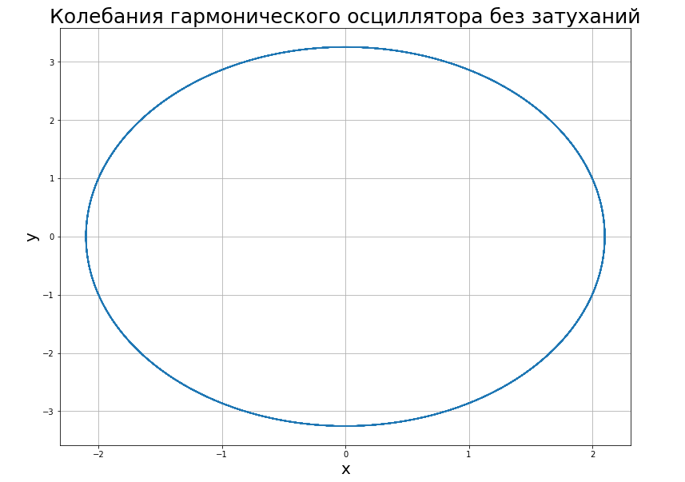
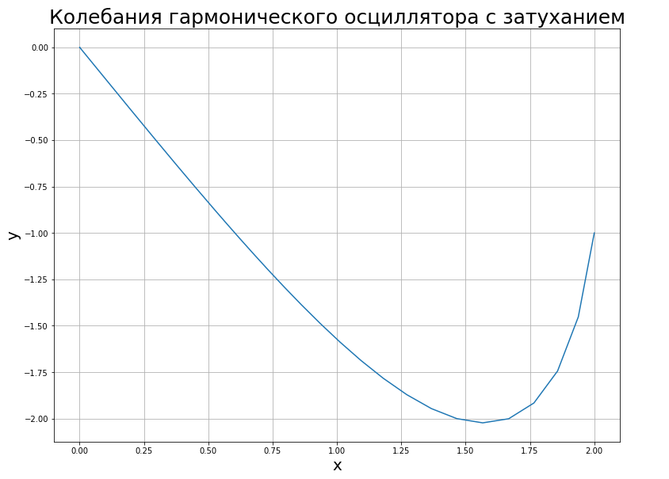
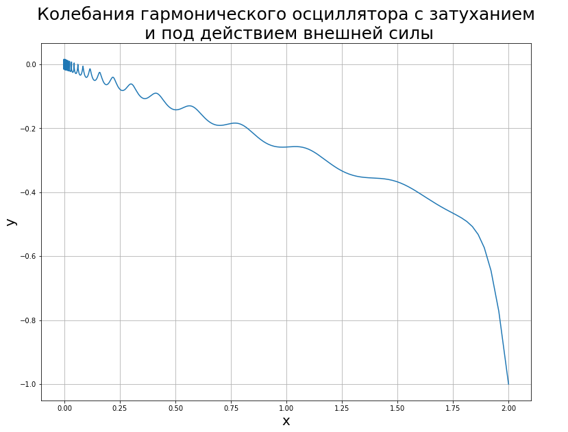

---
## Front matter
lang: ru-RU
title: Презентация по четвертой лабораторной. Предмет - Математическое моделирование.
author: |
	Попов Олег Павлович\inst{1}
institute: |
	\inst{1}RUDN University, Moscow, Russian Federation
date: 2021, 4 Марта -- 6 Марта

## Formatting
toc: false
slide_level: 2
theme: metropolis
header-includes:
 - \metroset{progressbar=frametitle,sectionpage=progressbar,numbering=fraction}
 - '\makeatletter'
 - '\beamer@ignorenonframefalse'
 - '\makeatother'
aspectratio: 43
section-titles: true
mainfont: DejaVuSerif
romanfont: DejaVuSerif
sansfont: DejaVuSans
monofont: DejaVuSansMono
fontsize: 10pt
---

# Модель гармонических колебаний

## Введение

Сегодня рассмотрим модель гармонических колебаний. Здесь все просто и
очевидно: данная модель помогает в расчете расположения маятника.
Основным отличием от школьных задачек по физике тут являются наличие
воздействия внешних сил и затухания.

## Теория

Уравнение свободных колебаний гармонического осциллятора имеет
следующий вид:

$x'' + 2\gamma x' + w_{0}^{2}x = f(t)$

где $x$ – переменная, описывающая состояние системы (смещение грузика, заряд
конденсатора и т.д.), $\gamma$ – параметр, характеризующий потери энергии (трение в механической системе, сопротивление в контуре), $w_{0}$ – собственная частота колебаний, $t$ – время. ($x'' = \frac{\delta ^{2}x}{\delta t^{2}}$, $x' = \frac{\delta x}{\delta t}$)

## Теория

Представленное уравнение есть линейное однородное дифференциальное уравнение
второго порядка и оно является примером линейной динамической системы.

При отсутствии потерь в системе ($\gamma = 0$) вместо данного уравнения получаем уравнение консервативного осциллятора энергия колебания которого сохраняется во времени.

$x'' + w_{0}^{2}x = 0$

## Теория

Для однозначной разрешимости уравнения второго порядка необходимо
задать два начальных условия вида:

$\begin{cases} x(t_{0}) = x_{0} \\ x'(t_{0}) = y_{0} \end{cases}$

Уравнение второго порядка можно представить в виде системы двух
уравнений первого порядка:

$\begin{cases} x' = y \\ y' = -w_{0}^{2}x \end{cases}$

## Теория

Начальные условия для такой системы примут вид:

$\begin{cases} x(t_{0}) = x_{0} \\ y(t_{0}) = y_{0} \end{cases}$

Независимые переменные $x, y$ определяют пространство, в котором
«движется» решение. Это фазовое пространство системы, поскольку оно двумерно
будем называть его фазовой плоскостью.

## Пример решения

{ #fig:001 width=95%}

## Пример решения

{ #fig:002 width=95%}

## Пример решения

{ #fig:003 width=95%}

## Итог

Значение фазовых координат $x, y$ в любой момент времени полностью
определяет состояние системы. Решению уравнения движения как функции
времени отвечает гладкая кривая в фазовой плоскости. Она называется фазовой
траекторией. Если множество различных решений (соответствующих различным
начальным условиям) изобразить на одной фазовой плоскости, возникает общая
картина поведения системы. Такую картину, образованную набором фазовых
траекторий, называют фазовым портретом.
