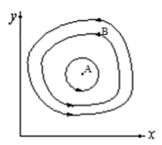
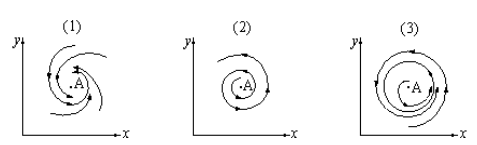

---
## Front matter
lang: ru-RU
title: Презентация по пятой лабораторной. Предмет - Математическое моделирование.
author: |
	Попов Олег Павлович\inst{1}
institute: |
	\inst{1}RUDN University, Moscow, Russian Federation
date: 2021, 11 Марта -- 13 Марта

## Formatting
toc: false
slide_level: 2
theme: metropolis
header-includes:
 - \metroset{progressbar=frametitle,sectionpage=progressbar,numbering=fraction}
 - '\makeatletter'
 - '\beamer@ignorenonframefalse'
 - '\makeatother'
aspectratio: 43
section-titles: true
mainfont: DejaVuSerif
romanfont: DejaVuSerif
sansfont: DejaVuSans
monofont: DejaVuSansMono
fontsize: 10pt
---

# Модель Лотки-Вольтерры

## Введение

Сегодня рассмотрим модель Лотки-Вольтерры или же модель "хищник-жертва".
Данная модель не дает максимально точных раезультатов, так как многие аспекты,
такие как смертность от несчастных случаев и тому подобные, в ней отсутствуют.
Однако, если нам не важна точность вычислений, то данная модель может пригодиться.
Также модель Лотки-Вольтерры используется как основа в большинстве других
модель, так что знание об этой модели лишним не будет.

## Теория

В жестком виде система модели "хищник-жертва" выглядит так:

$\frac{dx}{dt} = ax(t) - bx(t)y(t)$

$\frac{dy}{dt} = -cy(t) + dx(t)y(t)$

где x - число жертв, y - число хищников, a - коэффициент прироста жертв,
с - коэффициент смертности хищников. Вероятность взаимодействия жертвы
и хищника считается пропорциональной как количеству жертв, так и числу
самих хищников (xy). Каждый акт взаимодействия уменьшает популяцию жертв,
но способствует увеличению популяции хищников (члены -bxy и dxy в правой
части уравнения).

## Теория

Математический анализ этой (жесткой) модели показывает, что имеется
стационарное состояние (A на графике), всякое же другое начальное состояние (B)
приводит к периодическому колебанию численности как жертв, так и хищников,
так что по прошествии некоторого времени система возвращается в состояние B.

{ #fig:001 width=35%}

## Теория

Стационарное состояние системы (положение равновесия, не зависящее
от времени решение) будет в точке: $x_{0} = \frac{c}{d}, y_{0} = \frac{a}{b}$.
Если начальные значения задать в стационарном состоянии $x(0) = x_{0}, y(0) =
y_{0}$, то в любой момент времени численность популяций изменяться не будет.
При малом отклонении от положения равновесия численности как хищника, так и
жертвы с течением времени не возвращаются к равновесным значениям, а совершают
периодические колебания вокруг стационарной точки. Амплитуда колебаний и их
период определяется начальными значениями численностей $x(0), y(0)$. Колебания
совершаются в противофазе.

## Теория

При малом изменении жесткой модели мы получим мягкую модель.

$$\frac{dx}{dt} = ax(t) - bx(t)y(t) + \epsilon f(x, y)$$

$$\frac{dy}{dt} = -cy(t) + dx(t)y(t) + \epsilon g(x, y), \epsilon << 1$$

## Теория

В зависимости от вида малых поправок f и g возможны следующие сценарии:

{ #fig:002 width=80%}

В случае 1 равновесное состояние A устойчиво. При любых других начальных
условиях через большое время устанавливается именно оно.

## Теория

В случае 2 система стационарное состояние неустойчиво. Эволюция приводит
то к резкому увеличению числа хищников, то к их почти полному вымиранию.
Такая система в конце концов попадает в область столь больших или столь малых
значений x и y, что модель перестает быть применимой.

В случае 3 в системе с неустойчивым стационарным состоянием A с течением
времени устанавливается периодический режим. В отличие от исходной жесткой
модели Лотки-Вольтерры, в этой модели установившийся периодический режим не
зависит от начального условия. Первоначально незначительное отклонение от
стационарного состояния A приводит не к малым колебаниям около A, как в модели
Лотки-Вольтерры, а к колебаниям вполне определенной амплитуды. Возможны и другие
структурно устойчивые сценарии.

## Итог

Жесткую модель всегда надлежит исследовать на структурную устойчивость
полученных при ее изучении результатов по отношению к малым изменениям
модели (делающим ее мягкой).

В случае модели Лотки-Вольтерры для суждения о том, какой же из сценариев
1-3 (или иных возможных) реализуется в данной системе, совершенно необходима
дополнительная информация о системе.
