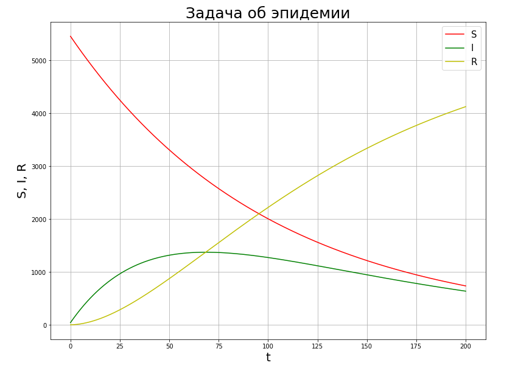

---
## Front matter
lang: ru-RU
title: Презентация по шестой лабораторной. Предмет - Математическое моделирование.
author: |
	Попов Олег Павлович\inst{1}
institute: |
	\inst{1}RUDN University, Moscow, Russian Federation
date: 2021, 18 Марта -- 20 Марта

## Formatting
toc: false
slide_level: 2
theme: metropolis
header-includes:
 - \metroset{progressbar=frametitle,sectionpage=progressbar,numbering=fraction}
 - '\makeatletter'
 - '\beamer@ignorenonframefalse'
 - '\makeatother'
aspectratio: 43
section-titles: true
mainfont: DejaVuSerif
romanfont: DejaVuSerif
sansfont: DejaVuSans
monofont: DejaVuSansMono
fontsize: 10pt
---

# Модель S.I.R.

## Введение

Сегодня рассмотрим модель SIR для решения задач об эпидемии. Предположим, что некая
популяция, состоящая из N особей, (считаем, что популяция изолирована)
подразделяется на три группы. Первая группа - это восприимчивые к болезни, но
пока здоровые особи, обозначим их через S(t). Вторая группа – это число
инфицированных особей, которые также при этом являются распространителями
инфекции, обозначим их I(t). А третья группа, обозначающаяся через R(t) – это
здоровые особи с иммунитетом к болезни.

## Теория

До того, как число заболевших не превышает критического значения $I^{*}$,
считаем, что все больные изолированы и не заражают здоровых. Когда $I(t) > I^{*}$,
тогда инфицирование способны заражать восприимчивых к болезни особей.

## Теория

Таким образом, скорость изменения числа S(t) меняется по следующему
закону:

$-\alpha S,$ если $I(t) > I^{*}$

$0,$ если $I(t) <= I^{*}$

## Теория

Поскольку каждая восприимчивая к болезни особь, которая, в конце концов,
заболевает, сама становится инфекционной, то скорость изменения числа
инфекционных особей представляет разность за единицу времени между
заразившимися и теми, кто уже болеет и лечится, т.е.:

$\alpha S - \beta I,$ если $I(t) > I^{*}$

$-\beta I,$ если $I(t) <= I^{*}$

## Теория

А скорость изменения выздоравливающих особей (при этом приобретающие
иммунитет к болезни): $\beta I$ для всех случаев.

Постоянные пропорциональности $\alpha , \beta$ - это коэффициенты заболеваемости
и выздоровления соответственно.

## Примеры графиков

## Примеры графиков

