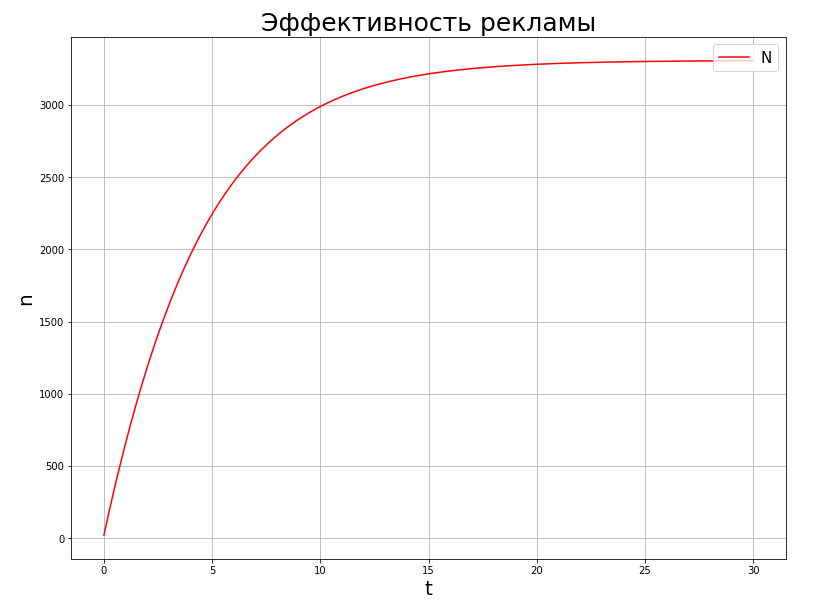

---
## Front matter
lang: ru-RU
title: Презентация по седьмой лабораторной. Предмет - Математическое моделирование.
author: |
	Попов Олег Павлович\inst{1}
institute: |
	\inst{1}RUDN University, Moscow, Russian Federation
date: 2021, 25 Марта -- 27 Марта

## Formatting
toc: false
slide_level: 2
theme: metropolis
header-includes:
 - \metroset{progressbar=frametitle,sectionpage=progressbar,numbering=fraction}
 - '\makeatletter'
 - '\beamer@ignorenonframefalse'
 - '\makeatother'
aspectratio: 43
section-titles: true
mainfont: DejaVuSerif
romanfont: DejaVuSerif
sansfont: DejaVuSans
monofont: DejaVuSansMono
fontsize: 10pt
---

# Модель рекламной компании.

## Введение

Сегодня рассмотрим модель рекламной компании для решения задач об
эффективности рекламы. Организуется рекламная кампания нового товара или
услуги. Необходимо, чтобы прибыль будущих продаж с избытком покрывала
издержки на рекламу. Вначале расходы могут превышать прибыль, поскольку лишь
малая часть потенциальных покупателей будет информирована о новинке. Затем,
при увеличении числа продаж, возрастает и прибыль, и, наконец, наступит
момент, когда рынок насытиться, и рекламировать товар станет бесполезным.

## Теория

Предположим, что торговыми учреждениями реализуется некоторая
продукция, о которой в момент времени t из числа потенциальных покупателей N
знает лишь n покупателей. Для ускорения сбыта продукции запускается реклама
по радио, телевидению и других средств массовой информации. После запуска
рекламной кампании информация о продукции начнет распространяться среди
потенциальных покупателей путем общения друг с другом. Таким образом, после
запуска рекламных объявлений скорость изменения числа знающих о продукции
людей пропорциональна как числу знающих о товаре покупателей, так и числу
покупателей о нем не знающих.

## Теория

Модель рекламной кампании описывается следующими величинами. Считаем, что
$\frac{dn}{dt}$ - скорость изменения со временем числа потребителей,
узнавших о товаре и готовых его купить, t - время, прошедшее с начала
рекламной кампании, n(t) - число уже информированных клиентов. Эта величина
пропорциональна числу покупателей, еще не знающих о нем, это описывается
следующим образом: $\alpha _{1}(t)(N-n(t))$, где N - общее число потенциальных
платежеспособных покупателей, $\alpha _{1} > 0$ - характеризует интенсивность
рекламной кампании (зависит от затрат на рекламу в данный момент времени).

## Теория

Помимо этого, узнавшие о товаре потребители также распространяют полученную
информацию среди потенциальных покупателей, не знающих о нем (в этом случае
работает т.н. сарафанное радио). Этот вклад в рекламу описывается величиной
$\alpha _{2}n(t)(N-n(t))$, эта величина увеличивается с увеличением
потребителей узнавших о товаре. Математическая модель распространения рекламы
описывается уравнением:

$\frac{dn}{dt} = (\alpha _{1}(t) + \alpha _{2}n(t))(N - n(t))$

## Теория

При $\alpha _{1}(t) >> \alpha _{2}(t)$ получается модель Мальтуса. При
$\alpha _{1}(t) << \alpha _{2}(t)$ получаем уравнение логистической кривой.

## Примеры графиков

{width=98%}

## Примеры графиков

{width=95%}

## Примеры графиков

{width=98%}
