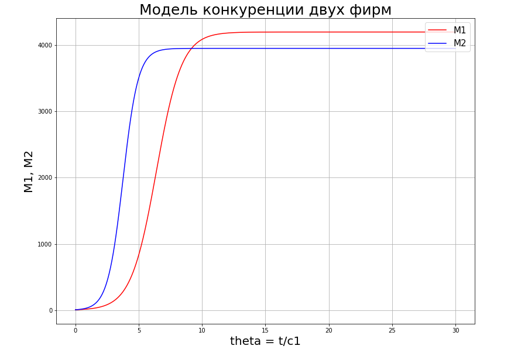
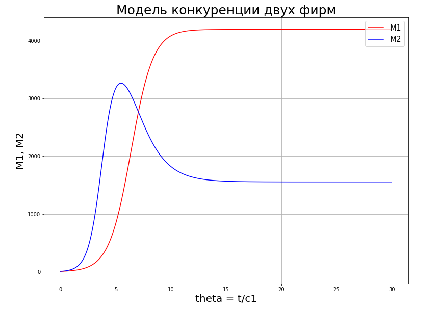

---
## Front matter
lang: ru-RU
title: Презентация по восьмой лабораторной. Предмет - Математическое моделирование.
author: |
	Попов Олег Павлович\inst{1}
institute: |
	\inst{1}RUDN University, Moscow, Russian Federation
date: 2021, 25 Марта -- 27 Марта

## Formatting
toc: false
slide_level: 2
theme: metropolis
header-includes:
 - \metroset{progressbar=frametitle,sectionpage=progressbar,numbering=fraction}
 - '\makeatletter'
 - '\beamer@ignorenonframefalse'
 - '\makeatother'
aspectratio: 43
section-titles: true
mainfont: DejaVuSerif
romanfont: DejaVuSerif
sansfont: DejaVuSans
monofont: DejaVuSansMono
fontsize: 10pt
---

# Модель конкуренции двух фирм

## Введение

Сегодня рассмотрим модель конкуренции двух фирм. Для построения модели
конкуренции хотя бы двух фирм необходимо рассмотреть модель одной фирмы.
Вначале рассмотрим модель фирмы, производящей продукт долговременного
пользования, когда цена его определяется балансом спроса и предложения.
Примем, что этот продукт занимает определенную нишу рынка и конкуренты
в ней отсутствуют.

## Модель одной фирмы

Обозначим:

N – число потребителей производимого продукта.

S – доходы потребителей данного продукта. Считаем, что доходы всех
потребителей одинаковы. Это предположение справедливо, если речь идет об
одной рыночной нише, т.е. производимый продукт ориентирован на определенный
слой населения.

M – оборотные средства предприятия

τ – длительность производственного цикла

## Модель одной фирмы

p – рыночная цена товара

p̃ – себестоимость продукта, то есть переменные издержки на производство
единицы продукции.

δ – доля оборотных средств, идущая на покрытие переменных издержек.

κ – постоянные издержки, которые не зависят от количества выпускаемой
продукции.

Q(S/p) – функция спроса, зависящая от отношения дохода S к цене p. Она
равна количеству продукта, потребляемого одним потребителем в единицу
времени.

## Модель одной фирмы

Функцию спроса товаров долговременного использования часто
представляют в простейшей форме:

$Q = q - k\frac{p}{S} = q(1 - \frac{p}{p_{cr}})$

где q – максимальная потребность одного человека в продукте в единицу времени.
Эта функция падает с ростом цены и при p = pcr (критическая стоимость продукта)
потребители отказываются от приобретения товара. Величина pcr = Sq/k.
Параметр k – мера эластичности функции спроса по цене. Таким образом, функция
спроса в форме (1) является пороговой (то есть, Q(S/p) = 0 при p ≥ pcr) и обладает
свойствами насыщения.

## Модель одной фирмы

Уравнения динамики оборотных средств можно записать в виде

$\frac{dM}{dt} = -\frac{M\delta}{\tau} + NQp - k = -\frac{M\delta}{\tau} + NQ(1 - \frac{p}{p_{cr}}) - k$

Уравнение для рыночной цены p представим в виде

$\frac{dp}{dt} = \gamma (-\frac{M\delta}{\tau p̃} + Nq(1 - \frac{p}{p_{cr}}))$

Первый член соответствует количеству поставляемого на рынок товара (то
есть, предложению), а второй член – спросу.

## Модель одной фирмы

Параметр γ зависит от скорости оборота товаров на рынке. Как правило,
время торгового оборота существенно меньше времени производственного цикла τ.
При заданном M уравнение описывает быстрое стремление цены к
равновесному значению цены, которое устойчиво.

В этом случае уравнение можно заменить алгебраическим соотношением

$-\frac{M\delta}{\tau p̃} + N(1 - \frac{p}{p_{cr}}) = 0$

## Модель одной фирмы

Из новой формулы следует, что равновесное значение цены p равно

$p = p_{cr}(1 - \frac{M\delta}{\tau p̃Nq})$

Получаем уравнение

$\frac{dM}{dt} = M\frac{\delta}{\tau}(\frac{p_{cr}}{p̃} - 1) - M^{2}(\frac{\delta}{\tau p̃})^{2}\frac{p_{cr}}{Nq} - k$

## Модель конкуренции двух фирм

Рассмотрим две фирмы, производящие взаимозаменяемые товары
одинакового качества и находящиеся в одной рыночной нише. Последнее означает,
что у потребителей в этой нише нет априорных предпочтений, и они приобретут
тот или иной товар, не обращая внимания на знак фирмы.

В этом случае, на рынке устанавливается единая цена, которая определяется
балансом суммарного предложения и спроса. Иными словами, в рамках нашей
модели конкурентная борьба ведётся только рыночными методами. То есть,
конкуренты могут влиять на противника путем изменения параметров своего
производства: себестоимость, время цикла, но не могут прямо вмешиваться в
ситуацию на рынке («назначать» цену или влиять на потребителей какимлибо иным способом.)

## Модель конкуренции двух фирм

Уравнения динамики оборотных средств запишем так

$\frac{dM_{1}}{dt} = -\frac{M_{1}}{\tau _{1}} + N_{1}q(1 - \frac{p}{p_{cr}})p - k_{1}$

$\frac{dM_{2}}{dt} = -\frac{M_{2}}{\tau _{2}} + N_{2}q(1 - \frac{p}{p_{cr}})p - k_{2}$

Величины N1 и N2 – числа потребителей, приобретших
товар первой и второй фирмы.

## Модель конкуренции двух фирм

Учтем, что товарный баланс устанавливается быстро, то есть,
произведенный каждой фирмой товар не накапливается, а реализуется по цене p.

Тогда

$\frac{M_{1}}{\tau _{1}p̃_{1}} = N_{1}q(1 - \frac{p}{p_{cr}})$

$\frac{M_{2}}{\tau _{2}p̃_{2}} = N_{2}q(1 - \frac{p}{p_{cr}})$

где p̃1 и p̃2 – себестоимости товаров в первой и второй фирме.

## Модель конкуренции двух фирм

С учетом двух систем получим

$\frac{dM_{1}}{dt} = -\frac{M_{1}}{\tau _{1}}(1 - \frac{p}{p̃_{1}}) - k_{1}$

$\frac{dM_{2}}{dt} = -\frac{M_{2}}{\tau _{2}}(1 - \frac{p}{p̃_{2}}) - k_{2}$

Считая, что ценовое равновесие устанавливается быстро, получим

$p = p_{cr}(1 - \frac{1}{Nq}(\frac{M_{1}}{\tau _{1}p̃_{1}} + \frac{M_{2}}{\tau _{2}p̃_{2}}))$

## Модель конкуренции двух фирм

Скрестив систему уравнений с уравнением ценового равновесия получим

$\frac{dM_{1}}{dt} = c_{1}M{1} - bM_{1}M_{2} - a_{1}M_{1}^{2} - k_{1}$

$\frac{dM_{2}}{dt} = c_{2}M{2} - bM_{1}M_{2} - a_{2}M_{2}^{2} - k_{2}$

где $a_{1,2} = \frac{p_{cr}}{\tau _{1,2}^{2}p̃_{1,2}^{2}Nq},
c_{1,2} = \frac{p_{cr} - p̃_{1,2}}{\tau _{1,2}p̃_{1,2}},
b = \frac{p_{cr}}{\tau _{1}^{2}\tau _{2}^{2}p̃_{1}^{2}p̃_{2}^{2}Nq}$

## Модель конкуренции двух фирм

При нормировке $t = c_{1}\theta$ получаем систему

$\frac{dM_{1}}{d\theta} = M_{1} - \frac{b}{c_{1}}M_{1}M_{2} - \frac{a_{1}}{c_{1}}M_{1}^{2}$

$\frac{dM_{2}}{d\theta} = \frac{c_{2}}{c_{1}}M_{2} - \frac{b}{c_{1}}M_{1}M_{2} - \frac{a_{2}}{c_{1}}M_{2}^{2}$

## Модель конкуренции двух фирм

Рассмотрим модель, когда, помимо экономического фактора влияния,
используются еще и социально-психологические факторы – формирование
общественного предпочтения одного товара другому, не зависимо от их качества
и цены. В этом случае взаимодействие двух фирм будет зависеть друг от друга,
соответственно коэффициент перед M1M2 будет отличаться.

$\frac{dM_{1}}{d\theta} = M_{1} - (\frac{b}{c_{1}} + const)M_{1}M_{2} - \frac{a_{1}}{c_{1}}M_{1}^{2}$

$\frac{dM_{2}}{d\theta} = \frac{c_{2}}{c_{1}}M_{2} - \frac{b}{c_{1}}M_{1}M_{2} - \frac{a_{2}}{c_{1}}M_{2}^{2}$

## Примеры графиков

{width=98%}

## Примеры графиков

{width=95%}
