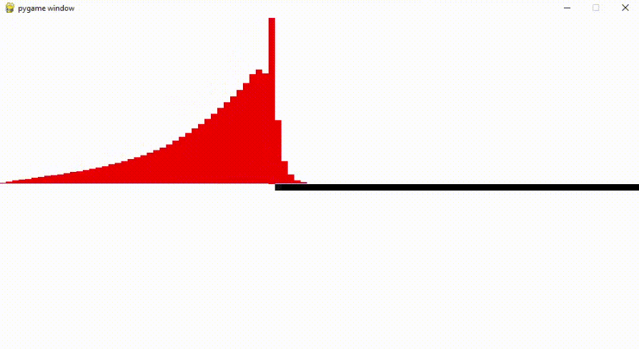
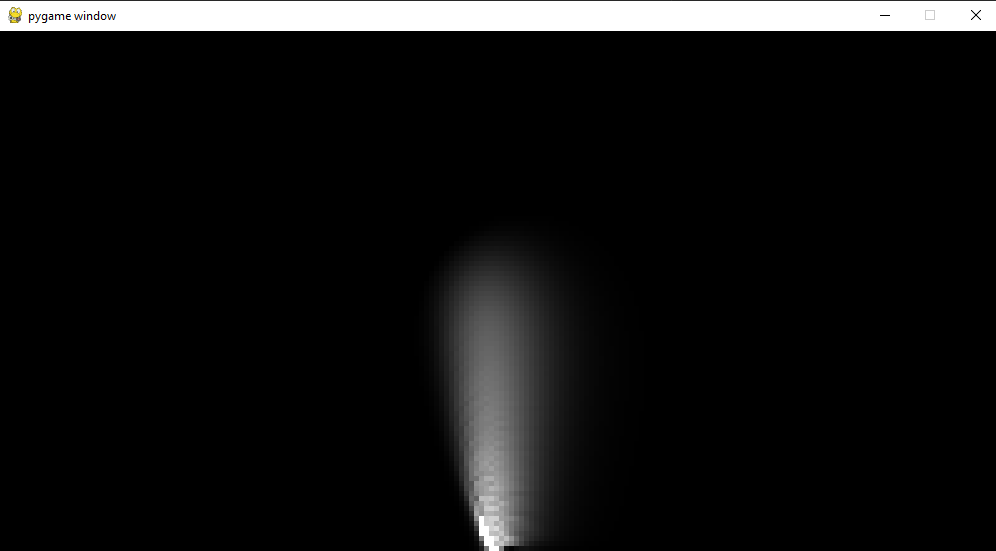
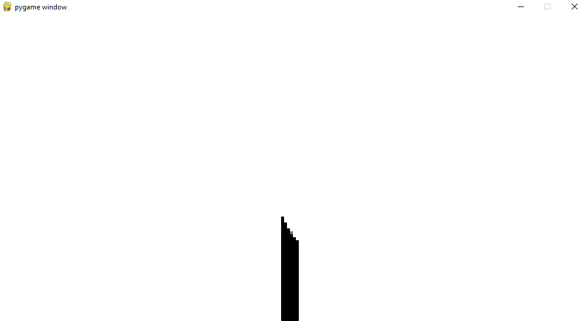
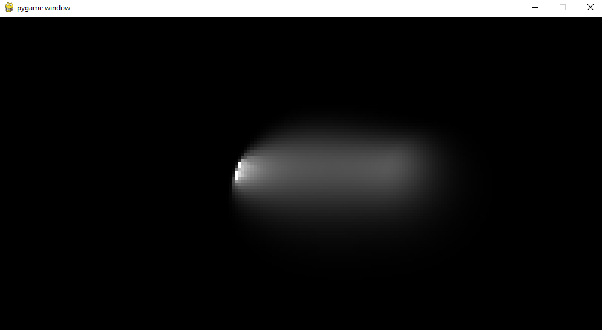
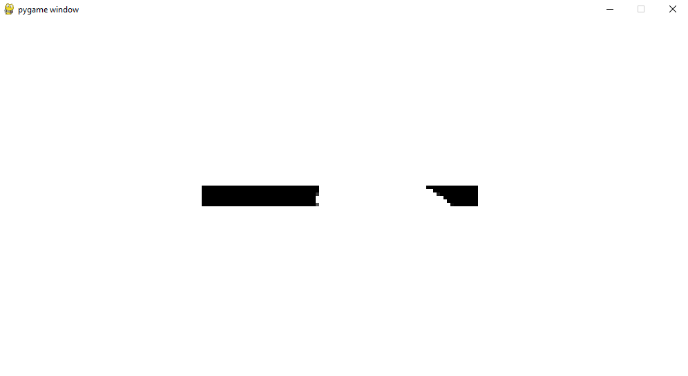

---
## Front matter
lang: ru-RU
title: Горение. Программная реализация.
author: |
	Кроз Елена, Ухарова Софья, Новикова Алина, Чупрына Петр, Попов Олег, Ширяев Кирилл\inst{1}
institute: |
	\inst{1}RUDN University, Moscow, Russian Federation
date: MatMod-2021, 13 Mar, 2021 Russia, Moscow

## Formatting
toc: false
slide_level: 2
theme: metropolis
header-includes:
 - \metroset{progressbar=frametitle,sectionpage=progressbar,numbering=fraction}
 - '\makeatletter'
 - '\beamer@ignorenonframefalse'
 - '\makeatother'
aspectratio: 43
section-titles: true
mainfont: DejaVuSerif
romanfont: DejaVuSerif
sansfont: DejaVuSans
monofont: DejaVuSansMono
fontsize: 10pt
---

## Краткое введение

Задача была поставлена следующая: смоделировать одномерное горение с неявной
разностной схемой и двумерное горение с явной разностной схемой.

Для реализации был использован язык программирования python версии 3.9.0

## Реализация одномерного горения

    import pygame as p
    from pygame.locals import *
    import numpy as np
    import time

    hi = 0.4
    ti = 0.1
    E = 1
    Ekrit = 6.56
    delta_t = 1
    h = 1
    step = 250

## Реализация одномерного горения

    m = 50*2
    n = 26*2

    pix = 10

    N = np.zeros(m)
    T = np.zeros(m)

    y_s = int(n/2-1)

    T[0] = 1

## Реализация одномерного горения

    for i in range(0,m):
        N[i] = 1

## Реализация одномерного горения

    def print_mas():
        for i in range(0,m):
            p.draw.rect(root, (255-255*N[i], 255-255*N[i], 255-255*N[i]), [i * pix, (y_s+1) * pix, pix, pix])

    def print_temper():
        p.draw.rect(root, (255, 255, 255), [0, 0, 1000, 260])
        for i in range(0,m):
            p.draw.rect(root, (255, 0, 0),
						    [i * pix, 260-260*T[i], pix, 260*T[i]])

## Реализация одномерного горения

    BLACK = (0, 0, 0)
    WHITE = (255, 255, 255)

    root = p.display.set_mode((1000, 520))

## Реализация одномерного горения

    root.fill(WHITE)

    for i in p.event.get():
			if i.type == QUIT:
				quit()
    p.display.update()

    print_mas()
    print_temper()

    p.display.update()
    time.sleep(1)

## Реализация одномерного горения [далее код в зацикленном while]

    for x in range(step):
			A = 0
			B = 0
			for i in range(0,m):
				b = -1 * (2 + 2 * (h * h) / (hi * delta_t))
				bd = 2 - 2 * (h * h) / (hi * delta_t)
				if T[i] != 0:
					deltaN = -1 * N[i] / ti * np.exp(-1 * E / T[i]) *
								delta_t
				else:
					deltaN = 0
				N[i] = N[i] + deltaN

## Реализация одномерного горения [продолжение цикла for в цикле for]

    if i == 0:
			d = -1 * T[i+1] + bd * T[i]
			a = 0
			c = 1
			A_next = (-1 * c) / (b - a * A)
			B_next = (d - a * B) / (b - a * A)
			T[i] = A_next * T[i+1] + B_next - deltaN

    elif i == m - 1:
			d = -1 * T[i-1] + bd * T[i]
			c = 0
			a = 1
			A_next = (-1 * c) / (b - a * A)
			B_next = (d - a * B) / (b - a * A)
			T[i] = A_next * T[i-1] + B_next - deltaN

## Реализация одномерного горения [продолжение цикла for в цикле for]

    else:
			a = 1
			c = 1
			d = -1 * T[i-1] + bd * T[i] - T[i+1]
			A_next = (-1 * c) / (b - a * A)
			B_next = (d - a * B) / (b - a * A)
			T[i] = A_next * T[i+1] + B_next - deltaN

    if (T[i] > 1): T[i] = 1
    if (T[i] < 0): T[i] = 0
    if (N[i] < 0): N[i] = 0

    A = A_next
    B = B_next

## Реализация одномерного горения [продолжение цикла for]

    print_mas()
    print_temper()
    p.display.update()
    time.sleep(0.2)

## Реализация одномерного горения [результат программы]

{ width=90% }

## Реализация двумерного горения

    import pygame as p
    from pygame.locals import *
    import numpy as np
    import time

    hi = 0.4
    ti = 0.00001
    E = 1
    Ekrit = 6.56
    delta_t = 1
    h = 1
    step = 250

## Реализация двумерного горения

    m = 50*4
    n = 26*4

    pix = 5

    N = np.zeros((n,m))
    T = np.zeros((n,m))

    newT = T

    x_s = int(m/2-1)
    y_s = int(n/2-1)

## Реализация двумерного горения [выбор между отображениями горизонтального или вертикального случаев]

    #___________________________________
    # Вертикальынй стержень
    #____________________________________

    T[y_s][x_s] = 1

    for i in range(y_s,n):
    	for j in range(x_s-3,x_s+3):
        N[i][j] = 1

## Реализация двумерного горения [выбор между отображениями горизонтального или вертикального случаев]

    #___________________________________
    # Горизонтальный стержень
    #____________________________________

    T[y_s-3][x_s] = 1

    for i in range(y_s-3,y_s+3):
    	for j in range(x_s-40,x_s+40):
      	N[i][j] = 1

## Реализация двумерного горения

    def print_temper():
    	for i in range(0,n):
      	for j in range(0,m):
        	p.draw.rect(root, (255 * T[i][j],255 * T[i][j],255 * T[i][j]),
					[j * pix, i * pix, pix, pix])

    def print_mas():
    	for i in range(0,n):
      	for j in range(0,m):
        	p.draw.rect(root, (255 - 255 * N[i][j],255 - 255 * N[i][j],
					255 - 255 * N[i][j]), [j * pix, i * pix, pix, pix])

## Реализация двумерного горения

    BLACK = (0, 0, 0)
    WHITE = (255, 255, 255)

    root = p.display.set_mode((1000, 520))

## Реализация двумерного горения [далее код в зацикленном while]

    root.fill(BLACK)

    for i in p.event.get():
      if i.type == QUIT:
        quit()
    p.display.update()

    print_temper()
    # print_mas()

    p.display.update()
    time.sleep(0.5)

    coef = hi * (delta_t / (h * h))

## Реализация двумерного горения [далее код в зацикленном while]

    for x in range(step):
    	for i in range(1,n):
				for j in range(1,m):
					# считаем изменение вещества
					if T[i][j]!=0:
						deltaN = -1 * N[i][j] / ti * \
						np.exp(-1*E/T[i][j]) * delta_t
					else: deltaN = 0

## Реализация двумерного горения [далее код в цикле {for j in range(1,m)} ]

    #изменение температуры в зависимости от точки
    if (i == 0 and j == 0):
			newT[i][j] = T[i][j] + coef * (T[i][j + 1] - 2 * T[i][j]) \
				+ coef * (T[i + 1][j] - 2 * T[i][j]) - deltaN

		if (i == 0 and j > 0 and j < m - 1):
			newT[i][j] = T[i][j] + coef * (T[i][j + 1] - 2 * T[i][j] \
				+ T[i][j - 1]) + coef * (T[i + 1][j] - 2 * T[i][j]) \
				- deltaN

		if (i == 0 and j == m - 1):
			newT[i][j] = T[i][j] + coef * (- 2 * T[i][j] + T[i][j - 1]) \
				+ coef * (T[i + 1][j] - 2 * T[i][j]) - deltaN

## Реализация двумерного горения [далее код в цикле {for j in range(1,m)} ]

    if (i > 0 and j == 0 and i < n - 1):
			newT[i][j] = T[i][j] + coef * (T[i][j + 1] - 2 * T[i][j]) \
				+ coef * (T[i + 1][j] - 2 * T[i][j] + T[i - 1][j]) - \
				deltaN

    if (i > 0 and j > 0 and i < n - 1 and j < m - 1):
			newT[i][j] = T[i][j] + coef * (T[i][j + 1] - 2 * T[i][j] \
				+ T[i][j - 1]) + coef * (T[i + 1][j] - 2 * T[i][j] \
				+	T[i - 1][j]) - deltaN

    if (i > 0 and j == m - 1 and i < n - 1):
			newT[i][j] = T[i][j] + coef * (- 2 * T[i][j] + T[i][j - 1]) \
				+ coef * (T[i + 1][j] - 2 * T[i][j] + T[i - 1][j]) - \
				deltaN

## Реализация двумерного горения [далее код в цикле {for j in range(1,m)} ]

    if (i == n - 1 and j == 0):
			newT[i][j] = T[i][j] + coef * (T[i][j + 1] - 2 * T[i][j]) \
				+ coef * (- 2 * T[i][j] + T[i - 1][j]) - deltaN

    if (i == n - 1 and j > 0 and j < m - 1):
			newT[i][j] = T[i][j] + coef * (T[i][j + 1] - 2 * T[i][j] + \
				T[i][j - 1]) + coef * (- 2 * T[i][j] + T[i - 1][j]) - \
				deltaN

    if (i == n - 1 and j == m - 1):
			newT[i][j] = T[i][j] + coef * (- 2 * T[i][j] + T[i][j - 1]) \
				+ coef * (- 2 * T[i][j] + T[i - 1][j]) - deltaN

## Реализация двумерного горения [далее код в цикле {for j in range(1,m)} ]

    N[i][j] = N[i][j] + deltaN
    if (N[i][j] < 0): N[i][j] = 0
    if(newT[i][j]>1): newT[i][j] = 1
    if(newT[i][j]<0): newT[i][j] = 0

## Реализация двумерного горения [далее код в цикле {for x in range(step)} ]

    T = newT

    # print_temper()
    print_mas()

    p.display.update()

## Результаты двумерного горения (температура, вертикальный стержень)

{ width=90% }

## Результаты двумерного горения (кол-во вещества, вертикальный стержень)

{ width=90% }

## Результаты двумерного горения (температура, горизонтальный стержень)

{ width=90% }

## Результаты двумерного горения (кол-во вещества, горизонтальный стержень)

{ width=90% }
