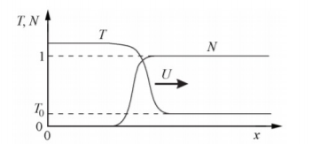
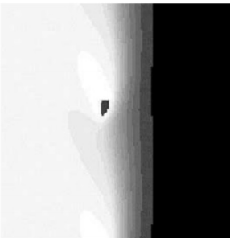
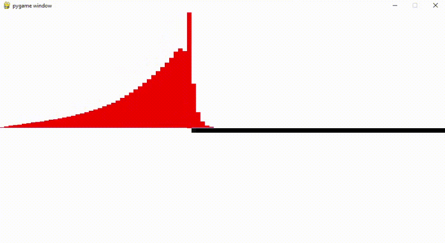
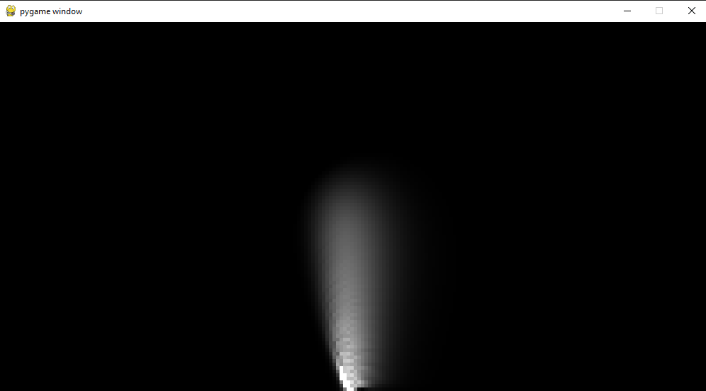
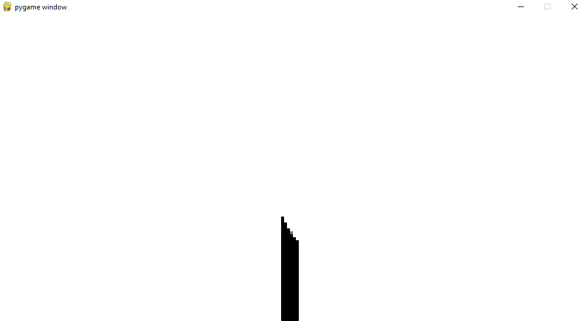
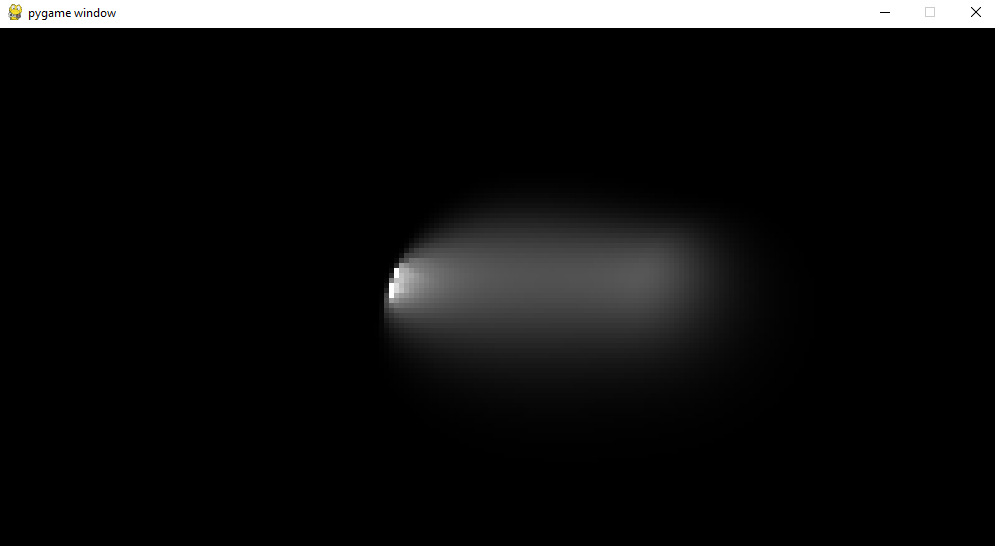
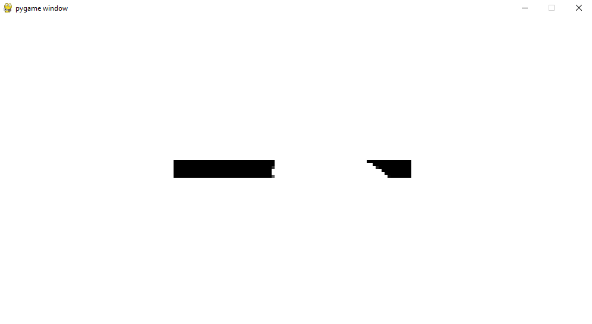

---
## Front matter
lang: ru-RU
title: Теплопроводность, детерминированное горение.
author: |
	Кроз Елена, Ухарова Софья, Новикова Алина, Чупрына Петр, Попов Олег, Ширяев Кирилл\inst{1}
institute: |
	\inst{1}RUDN University, Moscow, Russian Federation
date: MatMod-2021, 20 Mar, 2021 Russia, Moscow

## Formatting
toc: false
slide_level: 2
theme: metropolis
header-includes:
 - \metroset{progressbar=frametitle,sectionpage=progressbar,numbering=fraction}
 - '\makeatletter'
 - '\beamer@ignorenonframefalse'
 - '\makeatother'
aspectratio: 43
section-titles: true
mainfont: DejaVuSerif
romanfont: DejaVuSerif
sansfont: DejaVuSans
monofont: DejaVuSansMono
fontsize: 10pt
---
# Горение

Горение — это завораживающий и зрелищный феномен природы, одновременно являющийся интересным объектом для исследований.

## Описание задачи

Предлагается рассмотреть среду с учетом теплопроводности, в которой возможна экзотермическая химическая реакция (ХР). Численно
решая систему дифференциальных уравнений, можно исследовать различные режимы горения в одномерном и двумерном случаях.

## Простейший случай

Среда должна обладать **теплопроводностью** и возможностью протекания **экзотермической реакции**, скорость которой сильно возрастает
при увеличении температуры.

## Параметр E

E - безразмерная энергия активации, равная отношению
энергии активации к теплоте реакции.

## Режимы горения

- **Одномерный случай**: стационарный, пульсирующий(автоколебательный)

- **Двумерный случай**: стационарный, пульсирующий, спиновый

## Одномерный случай

**Стационарный режим** - скорость распространения волны постоянна, а профили температуры и концентрации переносятся вдоль оси X не деформируясь. (рис. -@fig:002)

{ #fig:002 width=40% }

## Одномерный случай

**Пульсирующий(автоколебательный) режим** - скорость волны переменная, и горение распространяется в виде чередующихся вспышек и угасаний.

-От значения параметра E, зависит какой режим реализуется.

## Двумерный случай

Фронт состоит из нескольких зон горения,
распространяющихся по винтовой линии
вдоль цилиндра(рис. -@fig:003)

{ #fig:003 width=40% }

## Явная разностная схема
Схема изменения безразмерной температуры за шаг времени
$$\begin{cases}\triangle N_i=-\frac{N_{i}}{\tau}e^{-E/T_{i}}\triangle t\\\widehat{T}_{i}=T_{i}+\frac{\chi\triangle t}{h^2}(T_{i+1}-2T_{i}+T_{i-1})-\triangle N_{i}\\\widehat{N}_{i}=N_{i}+\triangle N_{i}\end{cases}$$

## Неявная разностная схема
Неявная схема Кранка–Николсона, всегда устойчива
Система уравнений на временном слое
$$\widehat{T}_{i-1}-(2+\frac{2h^2}{\chi\triangle t})\widehat{T}_{i}+\widehat{T}_{i+1}=-T_{i-1}+(2-\frac{2h^2}{\chi\triangle t})T_{i}-T_{i+1}$$

## Программная реализация

Задача была поставлена следующая: смоделировать одномерное горение с неявной
разностной схемой и двумерное горение с явной разностной схемой.

Для реализации был использован язык программирования python версии 3.9.0

## Реализация одномерного горения [результат программы]

{ width=90% }

## Результаты двумерного горения (температура, вертикальный стержень)

{ width=90% }

## Результаты двумерного горения (кол-во вещества, вертикальный стержень)

{ width=90% }

## Результаты двумерного горения (температура, горизонтальный стержень)

{ width=90% }

## Результаты двумерного горения (кол-во вещества, горизонтальный стержень)

{ width=90% }

## Выводы

В результате выполнения проекта был рассмотрен процесс детерминированного
горения и построены модели одномерного горения с неявной разностной
схемой и двумерного горения с явной разностной схемой.
